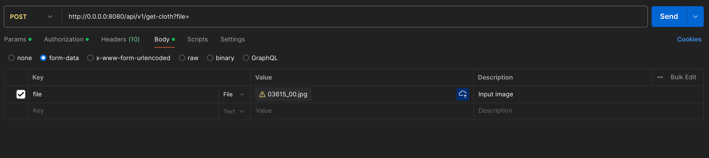
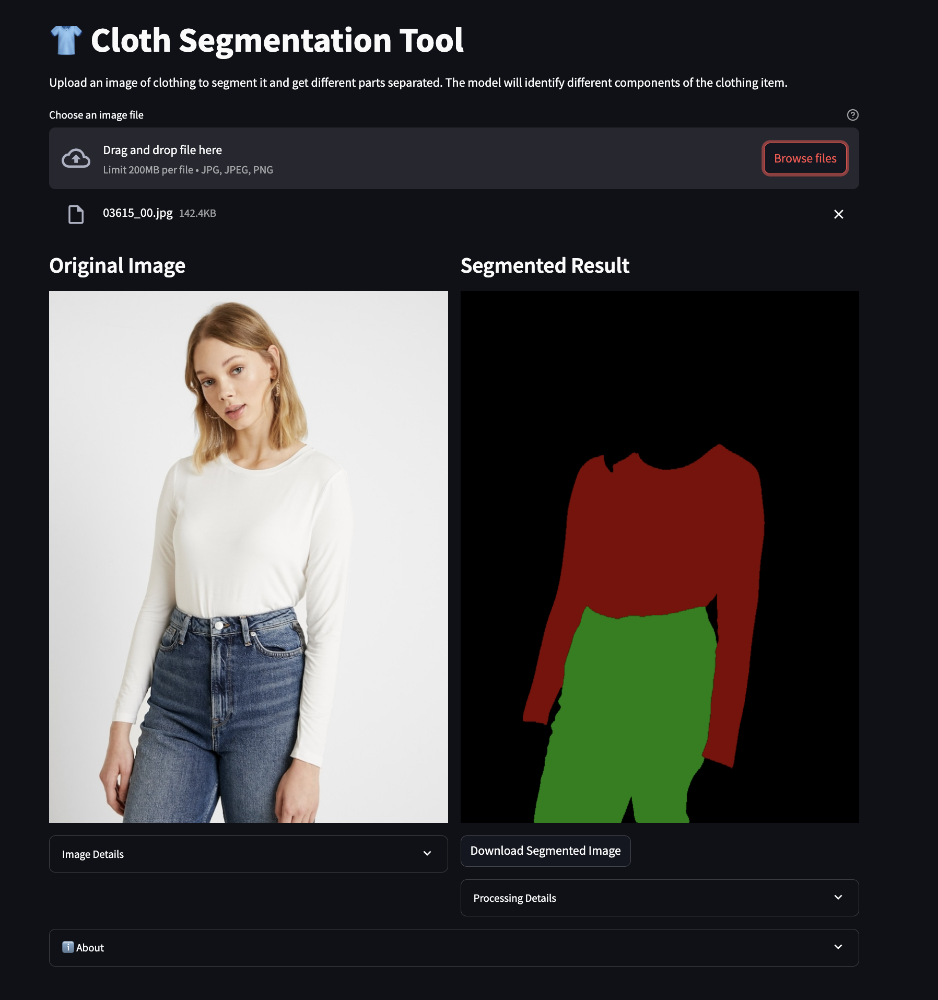

# Cloth Segmenter API

FastAPI to process the image and output the individual clothes mask.

## Approach

To the solution for the problem statement consiste of 2 essentiual components:
1. API Structure
2. Model Inference (Can be improved)

I have used a modular approach towards building the API infrastructure which makes it easier to use the steps involved in the process independently.

## Getting started

You will need poetry to setup the project locally. The project uses python3.10 as default python environment. Assuming poetry is configured properly, the following steps can be used to get started:

`poetry install --with infer (To run API and Streamlit Application)`

##### To run FastAPI server:

`make api`

##### To run StreamLIT UI for interactive Application:

`make run-streamlit`

##### To build the docker container for the API

`make docker-build`

##### To run the docker container

`make docker-run`

## Postman Interaction

After running the API locally:

You have to add a `POST` request to URL `http://0.0.0.0:8080/api/v1/get-cloth?file=` with a key named `file` and you can use the image provided in `tests/resources/images`

## Streamlit UI

## Scope of improvements:
1. ONNX model inference for reducing latency. ( `On mac: The default model is taking 5 sec on CPU mode, which will increase on GPU and if used with onnxruntime-gpu, it would give the least latency`)
2. Use of multistage docker for fast build process.
3. UV as package manager for faster compilations
4. Unit test cases for the functional testing.
5. Pydantic Objects

# References:

I have used the project for the model inference : https://github.com/wildoctopus/huggingface-cloth-segmentation